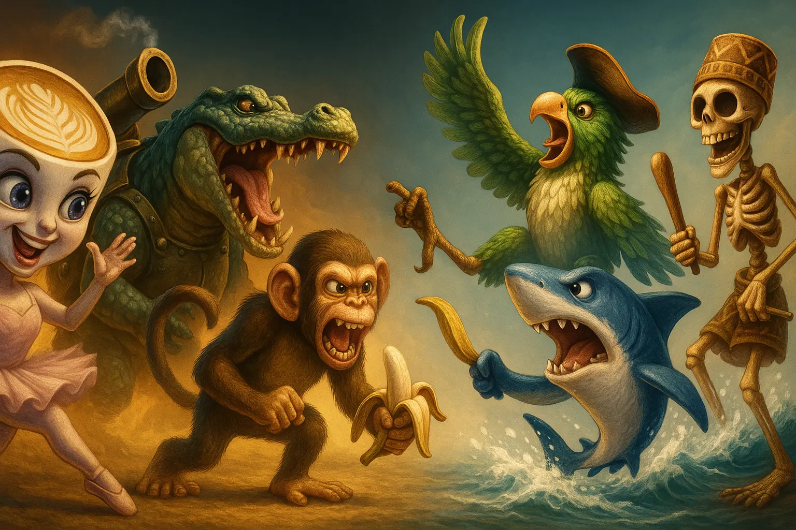

# Brainrot Battle

A fun, interactive web application where users can vote on absurd "brainrot" characters in head-to-head battles. The characters are ranked using an ELO rating system, similar to chess rankings. Partially vibe-coded, and partially written by myself.

Credits to https://brainrot.fandom.com for the images, and for the knowledge.

## 🎮 Features

- **Battle System**: Head-to-head voting between random pairs of brainrot characters
- **ELO Rating**: Characters are ranked using a chess-style ELO rating system that adjusts based on wins and losses
- **Leaderboard**: See which brainrot characters are dominating the competition
- **Skip Option**: Don't want to choose between two characters? Skip and get a new battle
- **Responsive Design**: Works on desktop and mobile devices

## 🧠 What is Brainrot?

Brainrot is absurd Internet slang that may lead to someone losing brain cells. Examples include:
- **Brr brr Patapim**: He is secretly Elon Musk
- **Cappuccino Assassino**: An extremely fast and silent assassin
- **Crocodilo Potatino**: A big ray of sunshine, who does not know he passed away
- **Trippi Troppi**: The king in the water, that can morph into a cat

## 🎯 How It Works

1. **Battles**: Two random brainrot characters are selected and presented to the user
2. **Voting**: Users click on their preferred character
3. **Rating Update**: The ELO ratings of both characters are adjusted based on the outcome
4. **Leaderboard**: Characters are ranked on the leaderboard based on their current ELO rating

## 🎥 Demonstration

https://github.com/user-attachments/assets/2321ba60-92a5-4f6d-bbc2-642508d74134
